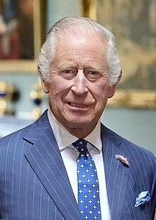
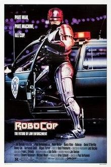

### URL: https://en.wikipedia.org/wiki/Celestine_(mineral)
**Content:** Celestine  (the  IMA -accepted name) [6]  or  celestite [1] [7] [a]  is a  mineral  consisting of  strontium sulfate  ( Sr S O 4 ). The mineral is named for its occasional delicate  blue color . Celestine and the  carbonate  mineral  strontianite  are the principal sources of the  element   strontium , commonly used in  fireworks  and in various  metal alloys .

---
### URL: https://en.wikipedia.org/wiki/Python_(programming_language)
**Content:** Python has been successfully embedded in many software products as a scripting language, including in  finite element method  software such as  Abaqus , 3D parametric modelers like  FreeCAD , 3D animation packages such as  3ds Max ,  Blender ,  Cinema 4D ,  Lightwave ,  Houdini ,  Maya ,  modo ,  MotionBuilder ,  Softimage , the visual effects compositor  Nuke , 2D imaging programs like  GIMP , [222]   Inkscape ,  Scribus  and  Paint Shop Pro , [223]  and  musical notation  programs like  scorewriter  and  capella .  GNU Debugger  uses Python as a  pretty printer  to show complex structures such as C++ containers.  Esri  promotes Python as the best choice for writing scripts in  ArcGIS . [224]  It has also been used in several video games, [225] [226]  and has been adopted as first of the three available  programming languages  in  Google App Engine , the other two being  Java  and  Go . [227]

---
### URL: https://en.wikipedia.org/wiki/Monarchy_of_the_United_Kingdom
**Content:** The British monarchy traces its origins from the  petty kingdoms  of  Anglo-Saxon England  and  early medieval Scotland , which consolidated into the kingdoms of  England  and  Scotland  by the 10th century. England was  conquered by the Normans  in 1066, after which  Wales  also gradually came under the control of  Anglo-Normans . The process was completed in the 13th century when the  Principality of Wales  became a  client state  of the English kingdom. The Anglo-Normans also established the  Lordship of Ireland . Meanwhile,  Magna Carta  began the process of reducing the English monarch's political powers. In the 16th century, English and Scottish monarchs played a central role in what became the religious  English Reformation  and  Scottish Reformation , and the English king became  King of Ireland . Beginning in 1603, the English and Scottish kingdoms were ruled by a  single sovereign . From 1649 to 1660, the tradition of monarchy was broken by the republican  Commonwealth of England , which followed the  Wars of the Three Kingdoms . Following the installation of  William III  and  Mary II  as co-monarchs in the  Glorious Revolution , the  Bill of Rights 1689 , and its Scottish counterpart the  Claim of Right Act 1689 , further curtailed the power of the monarchy and excluded  Roman Catholics  from succession to the throne. In 1707, the kingdoms of England and Scotland were merged to create the  Kingdom of Great Britain , and in 1801, the  Kingdom of Ireland  joined to create the  United Kingdom of Great Britain and Ireland .

---
### URL: https://en.wikipedia.org/wiki/Charlie_Parker
**Content:** Although he produced many brilliant recordings during this period, Parker's behavior became increasingly erratic. Heroin was difficult to obtain once he moved to California, where the drug was less abundant, so he used alcohol as a substitute. A recording for the  Dial  label from July 29, 1946, provides evidence of his condition. Before this session, Parker drank a quart [ clarification needed ]  of whiskey. According to the liner notes of  Charlie Parker on Dial Volume 1 , Parker missed most of the first two bars of his first chorus on the track "Max Making Wax". When he finally did come in, he swayed wildly and once spun all the way around, away from his microphone. On the next tune, " Lover Man ", producer  Ross Russell  physically supported Parker. On "Bebop" (the final track Parker recorded that evening), he begins a solo with a solid first eight bars; on his second eight bars, however, he begins to struggle, and a desperate  Howard McGhee , the trumpeter on this session, shouts, "Blow!" at him.  Charles Mingus  considered this version of "Lover Man" to be among Parker's greatest recordings, despite its flaws. [43]  Nevertheless, Parker hated the recording and never forgave Ross Russell for releasing it. He re-recorded the tune in 1951 for  Verve . Parker's life took a turn for the worse in March 1954 when his three-year-old daughter Pree died of  cystic fibrosis  and  pneumonia . [36]  He attempted suicide twice in 1954, which once again landed him in a mental hospital. [44]

---
### URL: https://arxiv.org/abs/2206.11795
**Content:** Abstract: Pretraining on noisy, internet-scale datasets has been heavily studied as a technique for training models with broad, general capabilities for text, images, and other modalities. However, for many sequential decision domains such as robotics, video games, and computer use, publicly available data does not contain the labels required to train behavioral priors in the same way. We extend the internet-scale pretraining paradigm to sequential decision domains through semi-supervised imitation learning wherein agents learn to act by watching online unlabeled videos. Specifically, we show that with a small amount of labeled data we can train an inverse dynamics model accurate enough to label a huge unlabeled source of online data -- here, online videos of people playing Minecraft -- from which we can then train a general behavioral prior. Despite using the native human interface (mouse and keyboard at 20Hz), we show that this behavioral prior has nontrivial zero-shot capabilities and that it can be fine-tuned, with both imitation learning and reinforcement learning, to hard-exploration tasks that are impossible to learn from scratch via reinforcement learning. For many tasks our models exhibit human-level performance, and we are the first to report computer agents that can craft diamond tools, which can take proficient humans upwards of 20 minutes (24,000 environment actions) of gameplay to accomplish.

---
### URL: https://en.wikipedia.org/wiki/Charles_III

---
### URL: https://en.wikipedia.org/wiki/RoboCop

---
### URL: https://en.wikipedia.org/wiki/Sonny_Rollins

---
